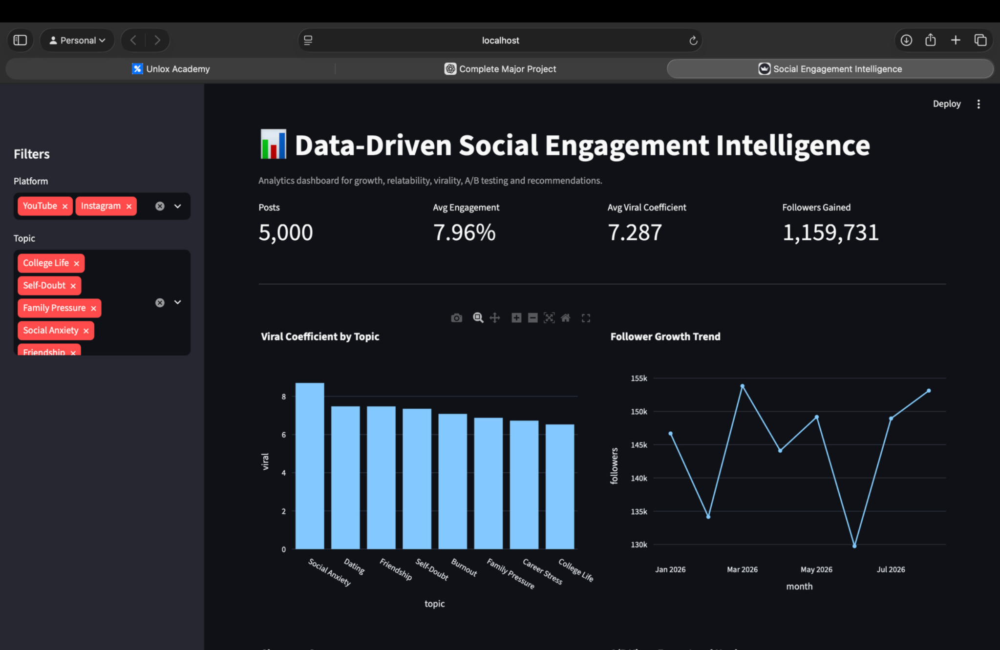
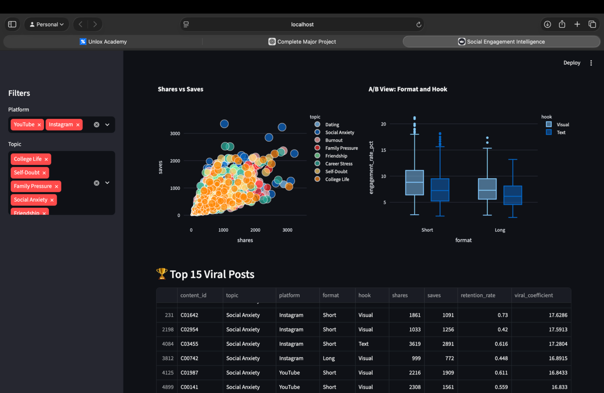
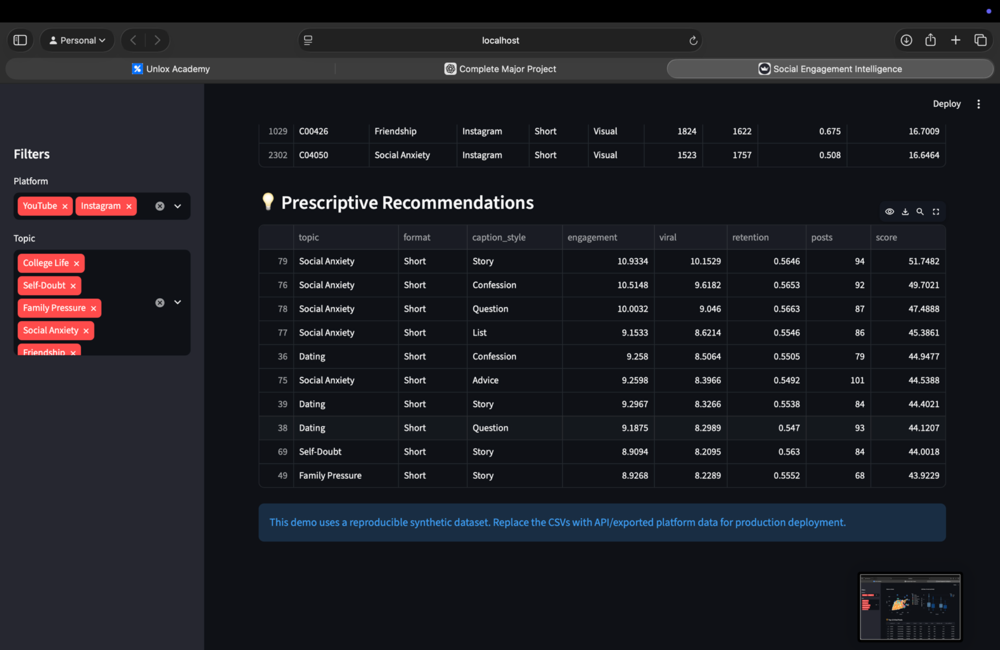

# 📊 Data-Driven Social Engagement Intelligence

> **Major Project | Python • SQL • Machine Learning • NLP • A/B Testing • Streamlit • Plotly**

An end-to-end analytics system that converts social-content performance data into actionable insights about **virality, audience relatability, experimentation, growth, forecasting, and content strategy**.

## 🚀 Live-style dashboard preview

### Executive dashboard


### Engagement, A/B testing & viral posts


### Prescriptive recommendations


---

## 🎯 Project Objective

The project is designed as a complete social-engagement intelligence pipeline:

- Track content performance across Instagram and YouTube
- Calculate and analyze a share/save-weighted **Viral Coefficient**
- Identify high-performing topics and content patterns
- Analyze audience comments using NLP-based relatability classification
- Compare content variants using statistical A/B testing
- Rank topic × format × caption combinations with a recommendation score
- Visualize follower growth and engagement signals
- Forecast topic-level viral performance for the next 14 days
- Provide a MySQL schema and analytical SQL layer
- Produce a 10-piece content test series for experimentation

## 🧩 System Architecture

```text
                    ┌──────────────────────────┐
                    │ Content Performance CSV  │
                    └────────────┬─────────────┘
                                 │
                    ┌────────────▼─────────────┐
                    │ Data Cleaning & Features │
                    └────────────┬─────────────┘
                                 │
        ┌────────────────────────┼────────────────────────┐
        │                        │                        │
        ▼                        ▼                        ▼
 Viral Prediction          NLP Relatability        A/B Testing
        │                        │                        │
        └────────────────────────┼────────────────────────┘
                                 ▼
                       Recommendations
                                 │
                       Trend Forecasting
                                 │
                                 ▼
                    Streamlit + Plotly Dashboard
```

## 📌 Key Modules

| Module | Implementation |
|---|---|
| Content Performance | Pandas-based CSV ingestion and cleaning |
| Virality Analysis | Share/save-weighted Viral Coefficient |
| Viral Prediction | Random Forest classifier |
| NLP Relatability | Rule-based NLP classification of comments |
| A/B Testing | Welch independent t-test with lift and p-value |
| Recommendations | Weighted ranking of topic, format and caption style |
| Growth Analytics | Streamlit + Plotly visualizations |
| Trend Forecasting | Linear regression with 14-day forecast |
| Database Layer | MySQL schema + analytical SQL queries |
| Content Strategy | 10-piece controlled creative test set |

## 📊 Dataset

The included demonstration dataset contains:

- **5,000** content-performance records
- **15,000** audience comments
- Instagram and YouTube content
- January–August 2026 synthetic demonstration period
- Multiple topics including Social Anxiety, Dating, Friendship, Career Stress, Burnout, Family Pressure, Self-Doubt and College Life

### ⚠️ Data disclosure

The dashboard uses a **reproducible synthetic dataset** because live platform API credentials and production exports are not included in the project brief. The displayed metrics are therefore demonstration results and should not be presented as real Instagram/YouTube audience findings.

For production use, replace the CSV ingestion layer with authenticated platform API/export data.

## 🧪 Demonstration Model Results

The included viral-prediction model reports:

- **ROC-AUC:** 0.9933
- **Accuracy:** 95.7%
- **Top demo topic by average viral coefficient:** Social Anxiety

These metrics are based on the supplied synthetic demonstration data.

## 🖥️ Run Locally

From the project root:

```bash
python3 -m pip install -r requirements.txt
python3 -m streamlit run app.py
```

Open:

```text
http://localhost:8501
```

### macOS troubleshooting

If `streamlit` is not found, use:

```bash
python3 -m streamlit run app.py
```

This avoids relying on the `streamlit` executable being on your PATH.

## ☁️ Deploy on Streamlit Community Cloud

1. Create a GitHub repository, for example:
   `data-driven-social-engagement-intelligence`
2. Upload the **contents of this project folder** to that repository.
3. Sign in to Streamlit Community Cloud with GitHub.
4. Create a new app and select your repository/branch.
5. Set **Main file path** to:

```text
 dashboard/app.py
```

6. Deploy.

The included `requirements.txt` and `.streamlit/config.toml` are already prepared for deployment.

## 📁 Project Structure

```text
Data-Driven-Social-Engagement/
├── assets/
│   ├── dashboard_overview.png
│   ├── analysis_and_viral_posts.png
│   └── recommendations.png
├── data/
│   ├── content_performance.csv
│   ├── user_comments.csv
│   ├── comments_analyzed.csv
│   ├── ab_test_results.csv
│   └── topic_forecast_14d.csv
├── app.py
├── src/
│   ├── data_cleaning.py
│   ├── viral_prediction.py
│   ├── sentiment_analyzer.py
│   ├── ab_testing.py
│   ├── recommender.py
│   ├── trend_forecasting.py
│   └── viral_model.joblib
├── sql/
│   ├── schema.sql
│   └── analysis_queries.sql
├── reports/
│   ├── strategy_report.pdf
│   ├── final_project_report.md
│   ├── content_series.md
│   └── model_results.json
├── .streamlit/
│   └── config.toml
├── PROJECT_RESULTS.json
├── requirements.txt
├── README.md
├── LICENSE
└── .gitignore
```

## 🔬 Example Analytical Questions

The project can answer questions such as:

- Which topics have the strongest viral performance?
- Which formats and hooks are associated with higher engagement?
- Which posts generate strong shares and saves?
- Which comments are classified as relatable?
- Which A/B variant performs better and is the difference statistically significant?
- Which topic × format × caption combinations should be prioritized?
- Which topics are forecast to gain viral momentum over the next 14 days?

## 🛠️ Tech Stack

**Python:** Pandas, NumPy, SciPy, Scikit-learn, Joblib, TextBlob, NLTK, spaCy

**Visualization:** Streamlit, Plotly

**Database:** MySQL / SQL

**Reporting:** Markdown, PDF

## 📈 Production Roadmap

1. Replace synthetic CSVs with authenticated Instagram Graph API and YouTube Data API exports.
2. Add scheduled ingestion and persistent database storage.
3. Replace rule-based NLP with a human-labeled ML/transformer classifier.
4. Use randomized experiment assignment for production A/B tests.
5. Add model monitoring and periodic retraining.
6. Add secure secrets management and production authentication.

## 💼 Resume-Ready Project Title

**Data-Driven Social Engagement Intelligence | Python, SQL, Scikit-learn, NLP, Streamlit, Plotly**

## 👨‍💻 Portfolio Note

This repository demonstrates an end-to-end data science workflow: **data preparation → feature engineering → statistical analysis → machine learning → NLP → forecasting → recommendations → interactive deployment**.


## GitHub Deployment Structure

This repository is intentionally flattened for one-click Streamlit deployment. The Streamlit entry point is `app.py` at the repository root, while datasets remain under `data/` and supporting code under `src/`.
